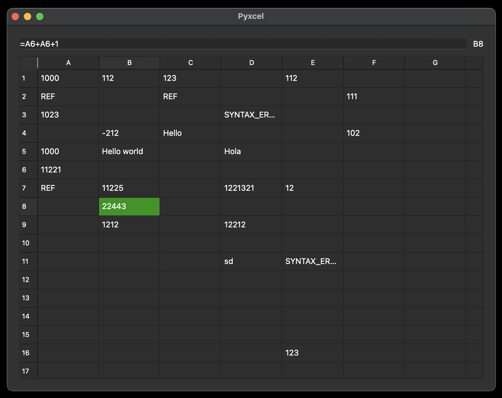

# Pyxcel

A brief description of the project: what it is and the main problems it solves.

## Table of Contents
- [About the Project](#about-the-project)
- [Features](#features)
- [Technologies](#technologies)
- [Installation](#installation)
- [Usage](#usage)
- [Tests](#tests)
- [Contact Information](#contact-information)

## About the Project
Pyxcel is an educational implementation of Excel, developed using Python and the Qt framework. It is designed to help users understand the core functionalities of spreadsheet software while being built on the Model-View architectural pattern (MV). This approach ensures a clean separation between data (Model) and user interface (View), promoting flexibility and scalability for future enhancements.



## Features

### A list of the main features provided by the project:
Here's the rewritten version for clarity and grammar:

- Arithmetic operations such as `+`, `-`, `*`, `/`, and parentheses `()` are supported.  
- Cell references like `A2` and `W40` can be used in formulas.  
- The table automatically recalculates all formulas whenever a referenced cell is updated.  
- An address helper in the top-right corner displays the address of the selected cell or the range of the selected area.  
- A text field is provided for entering long strings or formulas.  
- All data is saved to the database when the application is closed and automatically loaded when the application starts.

### Errors explanations:
- `NaN`: Indicates that the formula attempted a prohibited calculation, such as dividing by zero.
- `SYNTAX_ERROR`: Indicates that the user misspelled the formula or used unsupported functions or operations.
- `REF`: Indicates that the formula contains a reference to its own cell or a reference outside the allowed range.

## Technologies

A list of technologies, frameworks, and programming languages used in the project:
- Language Python
- Qt library for visualization
- Data store - sqlite3

## Installation

Instructions for setting up the project on a local machine:
1. Clone the repository:
   ```bash
   git clone https://github.com/Vita1ik/Pyxcel.git
   ```
2. Navigate to the project directory:
   ```bash
   cd Pyxcel
   ```
3. Install dependencies:
   ```bash
   TODO
   ```
4. Setup database:
   ```bash
   python setup.py
   ```
5. Seed database:
   ```bash
   python seeds.py
   ```

## Usage

Instructions for running and using the project:
```bash
python main.py
```

## Tests

Instructions for running tests:
```bash
python -m unittest discover -s tests
```
